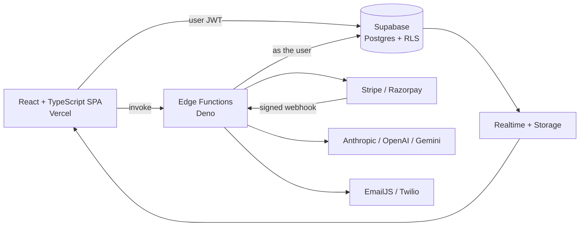
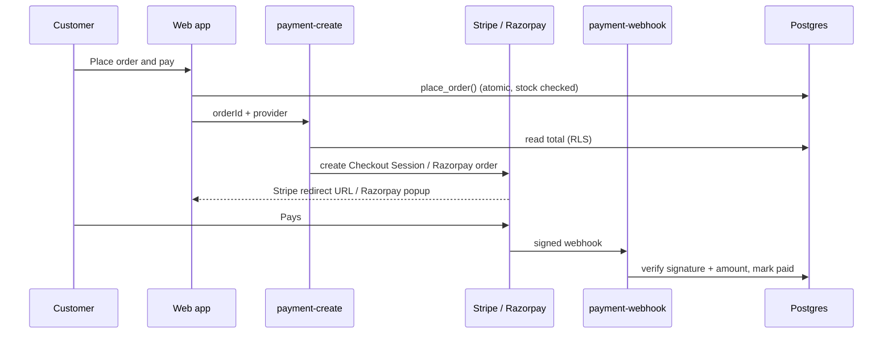

<div align="center">

# ⚒️ Forge

### Sell products. Build custom prototypes. Teach courses.
**One secure, multi-tenant platform for electronics, IoT, robotics and 3D-printing businesses.**


**Team Blasters**

[Features](#-features) · [Architecture](#-architecture) · [Security](#-security-model) · [Quick start](#-quick-start) · [Progress](#-what-is-done-so-far) · [Roadmap](#-roadmap)

</div>

---

## 🧩 The problem

Small hardware businesses run on disconnected tools: a store here, quotes in email, project chats elsewhere, invoices in a spreadsheet, support in another inbox. Data is re-typed and goes stale. Many SaaS tools check permissions only in the UI, so one front-end bug can expose another company's data. AI chatbots either cannot use business data, or can change it with no confirmation.

**Forge** puts it all behind one login, one organization and one database that enforces the rules.

## ✨ Features

| | Module | What it does |
|---|---|---|
| 🛒 | **Sell** | Catalog, cart, atomic checkout, Razorpay / Stripe / test provider, order timeline, refunds |
| 🛠️ | **Build** | Prototype requests through a 12-stage workflow; quotations the customer accepts or rejects |
| 🎓 | **Teach** | Courses, lessons, quizzes graded in SQL, progress, certificates with public verification |
| 🏢 | **Operate** | CRM pipeline, inventory, purchase orders, invoices, expenses, documents, tickets, reports |
| 🤖 | **Assist** | Forge Copilot answers questions and proposes actions. You confirm; Postgres decides |
| 🔔 | **Notify** | In-app alerts via DB triggers + Realtime; optional email (EmailJS) and SMS (Twilio) |

<details>
<summary><b>The 12 prototype stages</b></summary>

`Requested → Review → Requirements → Quotation → Approved → Design → Prototype → Testing → (Revision ↺ Prototype) → Production → Delivery → Completed`

Rules live in SQL: `advance_prototype` locks the row, allows only the next valid stage and writes an audit entry. A client cannot skip stages.
</details>

<details>
<summary><b>Who it serves</b></summary>

Customers · Students · Sales and Support · Engineers and Managers · Inventory and Finance · Organization Owners
</details>

## 🏗️ Architecture



**Edge Functions (5):** `ai-chat` · `payment-create` · `payment-webhook` · `refund-create` · `notify-dispatch`. All secrets live here, never in the browser.

### 💳 Payment flow



The browser never sends a price. The amount always comes from the database, and an order becomes `confirmed` only after a verified webhook.

## 🔐 Security model

| Layer | How |
|---|---|
| **Tenant isolation** | `organization_id` on every business row; `auth_org()` in every policy |
| **Permissions** | `has_perm('key')` joins `user_roles` and `role_permissions`. UI hiding is cosmetic |
| **AI runs as the user** | `ai-chat` queries with the caller's token, so it never exceeds their access |
| **Confirm-before-act** | The AI only *proposes* `cancel_order` or `create_ticket`; the user presses Confirm; RLS still decides; it is audit-logged |
| **No secrets in the browser** | Only the Supabase URL and anon key are public |
| **Payments** | Server-side amounts, signed webhooks, test provider disabled when `PAYMENTS_MODE=production`, no card data stored |
| **Input** | Zod schemas, DB check constraints, E.164 phone check, CSV formula-injection guard |

```sql
create policy prod_upd on products for update
  using (organization_id = auth_org() and has_perm('products.update'))
  with check (organization_id = auth_org());
```

## 🚀 Quick start

```bash
git clone <your-repo-url> && cd forge
npm install
cp .env.example .env        # fill VITE_SUPABASE_URL and VITE_SUPABASE_ANON_KEY
npm run dev
```

**1. Database.** In a new Supabase project, run `supabase/migrations/0001` to `0008` in order (or `supabase db push`), then `supabase/seed.sql`.

**2. Sign up and onboard.** Register, then create your organization. You become Owner with every permission.

**3. Deploy the Edge Functions and set secrets.**

```bash
supabase functions deploy ai-chat payment-create refund-create
supabase functions deploy payment-webhook --no-verify-jwt
supabase functions deploy notify-dispatch --no-verify-jwt

supabase secrets set AI_PROVIDER=anthropic AI_API_KEY=... AI_MODEL=...
supabase secrets set STRIPE_SECRET_KEY=sk_test_... STRIPE_WEBHOOK_SECRET=whsec_...
supabase secrets set RAZORPAY_KEY_ID=... RAZORPAY_KEY_SECRET=... RAZORPAY_WEBHOOK_SECRET=...
supabase secrets set SITE_URL=https://your-site.vercel.app PAYMENTS_MODE=development
```

**4. Webhooks.** Point each provider at `https://<project>.functions.supabase.co/payment-webhook?provider=stripe` (event `checkout.session.completed`) or `?provider=razorpay` (event `payment.captured`).

**5. Deploy the frontend** to Vercel with the two `VITE_` variables.

<details>
<summary><b>Notifications (EmailJS + Twilio)</b></summary>

1. Set `NOTIFY_WEBHOOK_SECRET`, `EMAILJS_*` and `TWILIO_*` secrets.
2. Supabase Dashboard → Database → Webhooks → new webhook on `notifications` (INSERT) → `notify-dispatch`, with header `x-webhook-secret`.
3. EmailJS template variables: `{{to_email}}`, `{{title}}`, `{{message}}`.

A channel without credentials is skipped silently.
</details>

<details>
<summary><b>Troubleshooting</b></summary>

- **"Payment could not be started"**: the function is not deployed to this project, or a CORS preflight failed. Redeploy all functions and check the Network tab for the `payment-create` request.
- **"The assistant is unavailable"**: set `AI_PROVIDER`, `AI_API_KEY` and `AI_MODEL`, redeploy `ai-chat`, and read its logs in Supabase.
- **Order stays `pending` after paying**: the webhook is missing or the signing secret is wrong.
- **Quick test without keys**: choose "Test payment" at checkout (works only while `PAYMENTS_MODE` is not `production`).
</details>

## 🧰 Tech stack

| Area | Tools |
|---|---|
| Frontend | React 18, TypeScript 5, Vite 5, Tailwind CSS 3, React Router 6, Lucide |
| Data | TanStack Query 5, Zod, Recharts |
| Backend | Supabase: Postgres, Auth, Realtime, Storage, Edge Functions (Deno) |
| AI | Provider abstraction: Anthropic, OpenAI or Gemini via env config |
| Payments | Razorpay, Stripe Checkout, development-only test provider |
| Quality | Vitest, TypeScript type-check, PWA shell |


</div>
